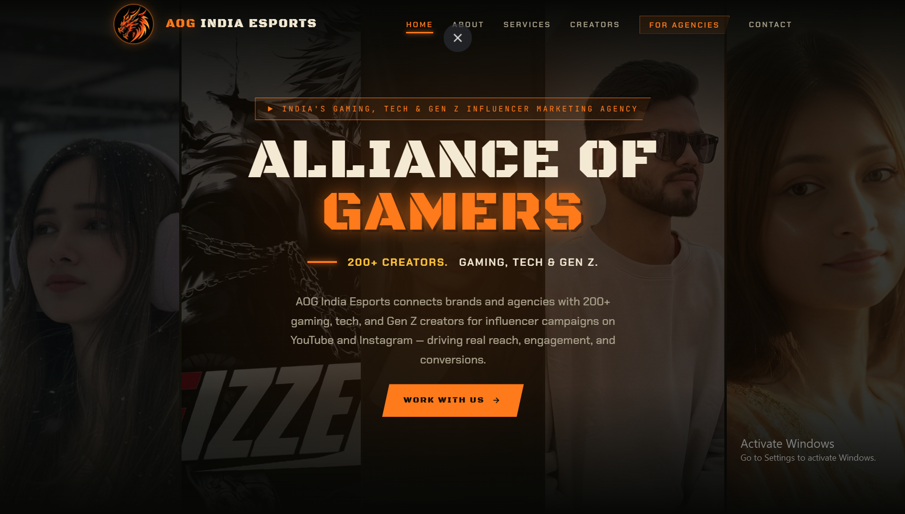
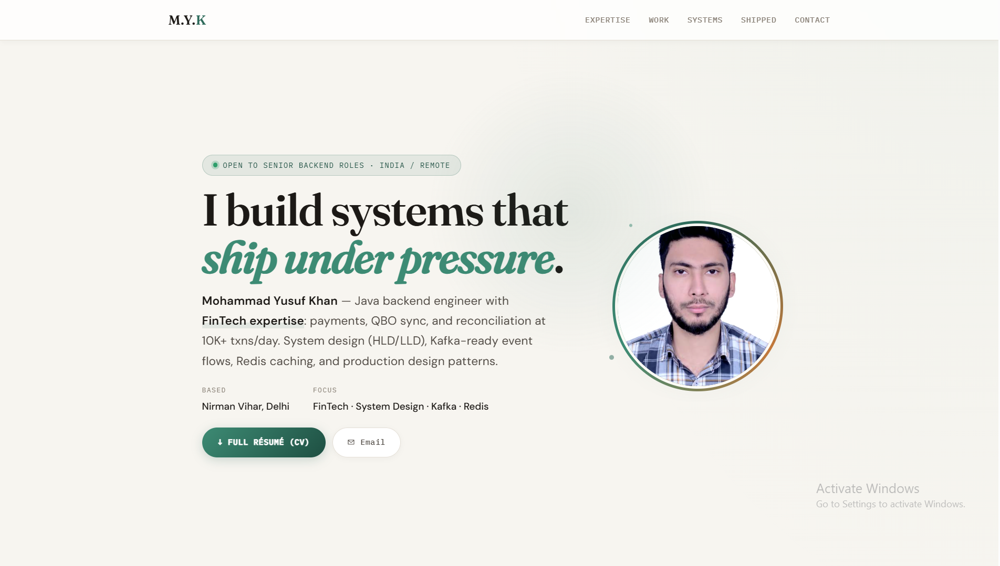
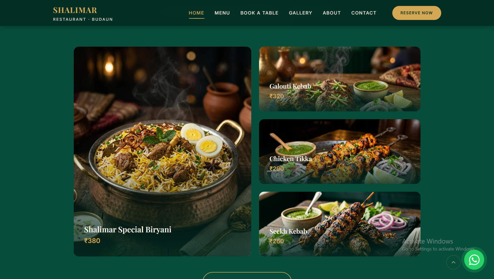
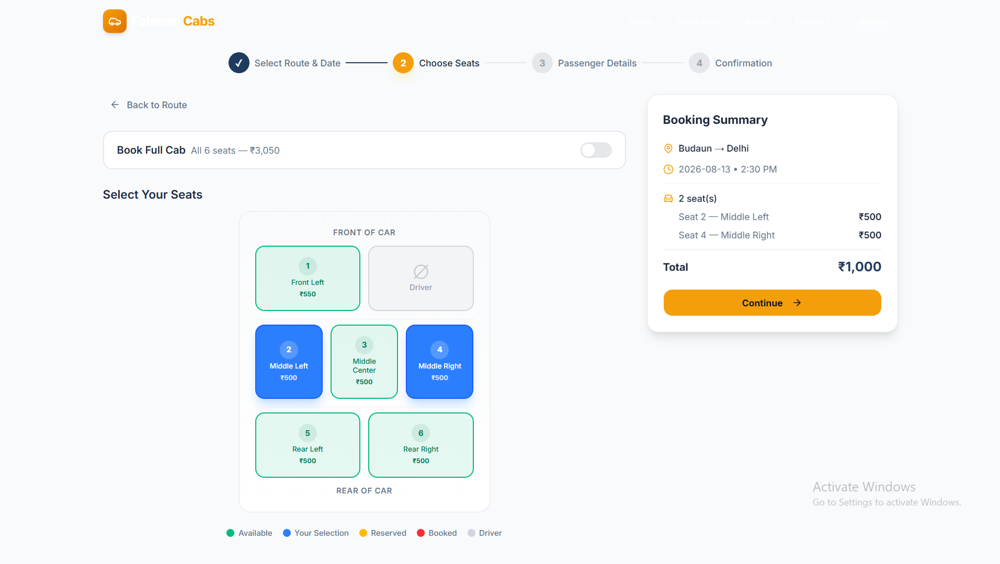
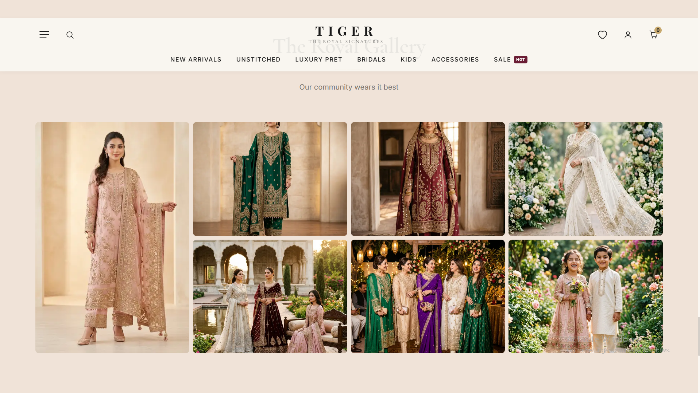
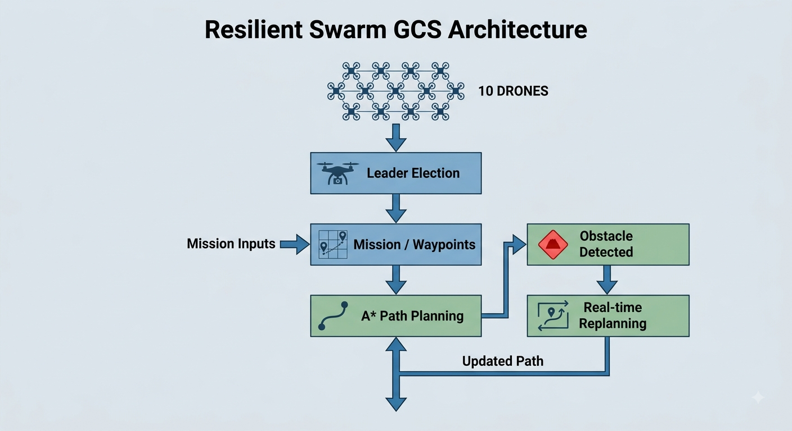

# Hi, I'm Mohammad Yusuf Khan 👋

### Software Development Engineer · Java & Spring Boot · Backend Engineering

> Building backend systems by day, growing an esports community by night.

I'm a software engineer focused on backend development, scalable systems,
and building real-world products from idea to deployment.

---

## 👨‍💻 About Me

- 🏢 Currently working as an **SDE at Flipkart**
- ☕ Building backend systems with **Java & Spring Boot**
- ⚙️ Interested in **distributed systems, system design, databases, and scalable architectures**
- 🎮 Founder of [**AOG India**](https://aogindia.com/), an esports and creator-focused platform
- 📚 Currently pursuing **MCA at Kurukshetra University**
- 🌱 Currently exploring **distributed systems, real-time architectures, and system design**
- 🧩 I enjoy building products that solve real-world problems
- 📫 Reach me at **mohammad.yusufkhan12345@gmail.com**

---

## ⚙️ Tech Stack

### Languages

<p>
  
  
  
</p>

### Backend

<p>
  
  
  
  
</p>

### Databases

<p>
  
  
  
  
</p>

### Frontend

<p>
  
  
  
  
</p>

### Tools & APIs

<p>
  
  
  
  
  
</p>

---

# 🚀 Featured Work

## 🎮 AOG India

<p align="center">
  <a href="https://aogindia.com/">
    
  </a>
</p>

### Founder · Builder · Operator

**AOG India** is an esports and creator-focused platform connecting
gaming creators, brands, and communities.

I founded and continue to build AOG India alongside my software engineering
career, working across technology, partnerships, sponsorships, and community
growth.

**Focus**

`Esports` · `Creators` · `Brand Partnerships` · `Sponsorships` · `Community`

🌐 [**Visit AOG India →**](https://aogindia.com/)  
💻 [**View Repository →**](https://github.com/m-y-k/aogindia)

---

## 💼 My Portfolio

<p align="center">
  <a href="https://mohammadyusufkhan.in/">
    
  </a>
</p>

A personal portfolio built to showcase my engineering experience,
projects, skills, and work.

**Tech**

`HTML` · `CSS` · `JavaScript` · `AI`

🌐 [**Visit Portfolio →**](https://mohammadyusufkhan.in/)  
💻 [**View Repository →**](https://github.com/m-y-k/My-Portfolio)

---

## 🍽️ Shalimar Restaurant

<p align="center">
  <a href="https://shalimar-restaurant-bdn.onrender.com/">
    
  </a>
</p>

A full-stack restaurant website built for a local business, combining
a modern frontend with a Java/Spring Boot backend and REST APIs.

**Tech**

`Java` · `Spring Boot` · `React` · `REST API`

🌐 [**Visit Website →**](https://shalimar-restaurant-bdn.onrender.com/)  
💻 [**View Repository →**](https://github.com/m-y-k/shalimar-restaurant-bdn)

---

## 🚕 Faheem Cabs

<p align="center">
  <a href="https://faheem-cabs.onrender.com/">
    
  </a>
</p>

A cab booking platform focused on travel between **Budaun and Delhi**,
designed around a simple booking experience for local customers.

**Focus**

`Cab Booking` · `Travel` · `Local Business`

🌐 [**Visit Website →**](https://faheem-cabs.onrender.com/)  
💻 [**View Repository →**](https://github.com/m-y-k/faheem-cabs-demo)

---

## 👑 Tiger The Royal Signatures

<p align="center">
  <a href="https://tiger-the-royal-signatures-pvt-ltd.onrender.com/">
    
  </a>
</p>

A business website built for **Tiger The Royal Signatures Pvt. Ltd.**,
designed to establish an online presence and showcase the business.

**Focus**

`Business Website` · `Responsive Design` · `Web Development`

🌐 [**Visit Website →**](https://tiger-the-royal-signatures-pvt-ltd.onrender.com/)  
💻 [**View Repository →**](https://github.com/m-y-k/tiger-the-royal-signatures-pvt-ltd)

---

# 🤖 Resilient Swarm GCS

<p align="center">
  <a href="https://github.com/m-y-k/resilient-swarm-gcs">
    
  </a>
</p>

### Multi-Drone Mission Control & Real-Time Path Planning

A group of **10 drones** execute a mission after receiving waypoints
on a map.

The drones use a consensus-based mechanism to **elect a leader** and
coordinate the mission. The system uses the **A\*** pathfinding algorithm
to calculate routes, while continuously responding to obstacles during
flight.

When an obstacle appears, the system recalculates the path and updates
the route in **real time**, allowing the swarm to adapt during the mission.

**Key Concepts**

`Distributed Systems` · `Leader Election` · `Consensus` · `A* Pathfinding`
· `Real-Time Systems` · `Multi-Agent Systems` · `Obstacle Avoidance`

**Highlights**

- 🛸 10-drone swarm mission
- 🗺️ Waypoint-based mission planning
- 👑 Consensus-based leader election
- 🧭 A* pathfinding
- ⚡ Real-time obstacle detection and path recalculation
- 🔄 Dynamic route adaptation during mission execution

**Tech**

`Java` · `A* Algorithm` · `Distributed Systems`

💻 [**View Repository →**](https://github.com/m-y-k/resilient-swarm-gcs)

---

# 🧩 What I Like Building

```text
Backend Systems
       ↓
Java · Spring Boot · REST APIs · Databases
       ↓
Distributed & Scalable Architectures
       ↓
Real-Time Systems · Integrations · Automation
       ↓
Real-World Products
