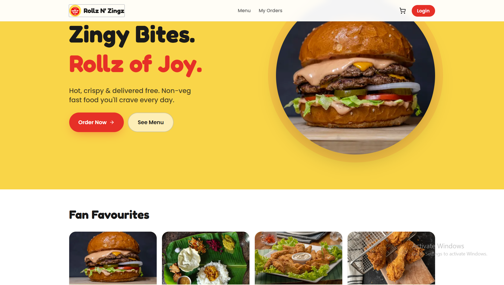

# Hi, I'm Mohammad Yusuf Khan 👋

### Software Development Engineer · Java & Spring Boot · Backend Engineering

> Building backend systems by day, growing an esports community by night.

I'm a software engineer focused on backend development, scalable systems,
and building real-world products from idea to deployment.

---

## 👨‍💻 About Me

- 🏢 Currently working as an **SDE at Flipkart**
- ☕ Building backend systems with **Java & Spring Boot**
- ⚙️ Interested in **distributed systems, system design, databases, and scalable architectures**
- 🎮 Founder of [**AOG India**](https://aogindia.com/), an esports and creator-focused platform
- 📚 Currently pursuing **MCA at Kurukshetra University**
- 🌱 Currently exploring **distributed systems, real-time architectures, and system design**
- 🧩 I enjoy building products that solve real-world problems
- 📫 Reach me at **mohammad.yusufkhan12345@gmail.com**

---

## ⚙️ Tech Stack

### Languages

<p>
  
  
  
</p>

### Backend

<p>
  
  
  
  
</p>

### Databases

<p>
  
  
  
  
</p>

### Frontend

<p>
  
  
  
  
</p>

### Tools & APIs

<p>
  
  
  
  
  
</p>

---

# 🚀 Featured Work

## 🎮 AOG India

<p align="center">
  <a href="https://aogindia.com/">
    
  </a>
</p>

<p align="center">
  <b>Founder · Builder · Platform</b>
</p>

<p>
AOG India is an esports and creator-focused platform connecting gaming
creators, brands, and communities.
</p>

<p>
<a href="https://aogindia.com/">🌐 Visit Website →</a>
&nbsp;&nbsp;·&nbsp;&nbsp;
<a href="https://github.com/m-y-k/aogindia">💻 Repository →</a>
</p>

<hr>

<table>
<tr>
<td width="50%" valign="top">

<h3>💼 My Portfolio</h3>

<a href="https://mohammadyusufkhan.in/">

</a>

<p>
Personal developer portfolio showcasing my engineering experience,
projects, skills, and work.
</p>

<p>
<a href="https://mohammadyusufkhan.in/">🌐 Visit Website →</a>
&nbsp;·&nbsp;
<a href="https://github.com/m-y-k/My-Portfolio">💻 Repository →</a>
</p>

</td>

<td width="50%" valign="top">

<h3>🍽️ Shalimar Restaurant</h3>

<a href="https://shalimar-restaurant-bdn.onrender.com/">

</a>

<p>
Full-stack restaurant website built for a local business using
Spring Boot, React, and REST APIs.
</p>

<p>
<a href="https://shalimar-restaurant-bdn.onrender.com/">🌐 Visit Website →</a>
&nbsp;·&nbsp;
<a href="https://github.com/m-y-k/shalimar-restaurant-bdn">💻 Repository →</a>
</p>

</td>
</tr>

<tr>
<td width="50%" valign="top">

<h3>🚕 Faheem Cabs</h3>

<a href="https://faheem-cabs.onrender.com/">

</a>

<p>
Cab booking platform focused on convenient travel between
Budaun and Delhi.
</p>

<p>
<a href="https://faheem-cabs.onrender.com/">🌐 Visit Website →</a>
&nbsp;·&nbsp;
<a href="https://github.com/m-y-k/faheem-cabs-demo">💻 Repository →</a>
</p>

</td>

<td width="50%" valign="top">

<h3>👑 Tiger The Royal Signatures</h3>

<a href="https://tiger-the-royal-signatures-pvt-ltd.onrender.com/">

</a>

<p>
Responsive business website built for Tiger The Royal Signatures
Pvt. Ltd.
</p>

<p>
<a href="https://tiger-the-royal-signatures-pvt-ltd.onrender.com/">🌐 Visit Website →</a>
&nbsp;·&nbsp;
<a href="https://github.com/m-y-k/tiger-the-royal-signatures-pvt-ltd">💻 Repository →</a>
</p>

</td>
</tr>

<tr>
<td width="50%" valign="top">

<h3>🍔 Rollz N' Zingz</h3>

<a href="https://rollz-n-zingz.vercel.app/">

</a>

<p>
Online food ordering website featuring burgers, chicken momos,
winger burgers, and other fast-food options.
</p>

<p>
<a href="https://rollz-n-zingz.vercel.app/">🌐 Visit Website →</a>
&nbsp;·&nbsp;
<a href="https://github.com/m-y-k/rollz-n-zingz">💻 Repository →</a>
</p>

</td>

<td width="50%" valign="top">

<h3>🤖 Resilient Swarm GCS</h3>

<a href="https://github.com/m-y-k/resilient-swarm-gcs">

</a>

<p>
Self-healing ground control station for a 10-drone swarm with
distributed leader election, sub-300ms failover, real-time A*
obstacle avoidance, and mission-grade telemetry.
</p>

<p>
<a href="https://github.com/m-y-k/resilient-swarm-gcs">💻 Repository →</a>
</p>

</td>
</tr>
</table>

---

# 🧩 What I Like Building

```text
Backend Systems
       ↓
Java · Spring Boot · REST APIs · Databases
       ↓
Distributed & Scalable Architectures
       ↓
Real-Time Systems · Integrations · Automation
       ↓
Real-World Products
